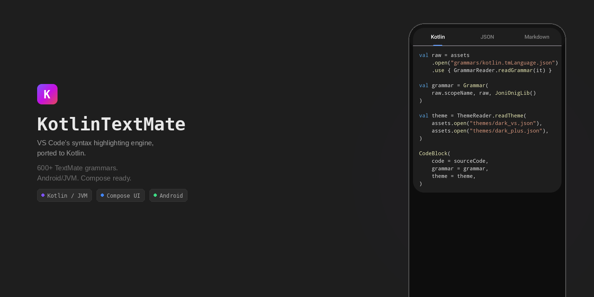

[](https://github.com/ivan-magda/kotlin-textmate/actions/workflows/ci.yml)
[](https://github.com/ivan-magda/kotlin-textmate/actions/workflows/benchmark.yml)
[](LICENSE)

A Kotlin/JVM port of [vscode-textmate](https://github.com/microsoft/vscode-textmate) — TextMate grammar tokenizer for syntax highlighting on Android and JVM.

## Why

Existing TextMate engines for the JVM are either abandoned or tied to specific ecosystems.
[codroid-textmate](https://github.com/haodong404/codroid-textmate) has been dormant since 2022.
[tm4e](https://github.com/eclipse-tm4e/tm4e) targets Eclipse and requires Java 21.
Neither provides a Compose UI layer.

The alternative is [Highlights](https://github.com/SnipMeDev/Highlights), which uses hand-written regex and supports 17 languages.

TextMate grammars — the same format VS Code uses — cover 600+ languages and are actively maintained.
KotlinTextMate ports vscode-textmate to Kotlin with Compose integration and published conformance tests and benchmarks.

## Features

- Loads standard `.tmLanguage.json` grammars — the same files VS Code uses
- VS Code JSON theme support (Dark+, Light+, or any `tokenColors`-based theme)
- Jetpack Compose `CodeBlock` composable with `AnnotatedString` output
- [Joni](https://github.com/jruby/joni) (Java Oniguruma) regex engine with graceful fallback for unsupported patterns
- Line-by-line tokenization with persistent state across lines

## Quick start

```kotlin
// Load a grammar
val rawGrammar = assets.open("grammars/kotlin.tmLanguage.json")
    .use { GrammarReader.readGrammar(it) }
val grammar = Grammar(rawGrammar.scopeName, rawGrammar, JoniOnigLib())

// Load a theme (base + overlay, same as VS Code)
val theme = assets.open("themes/dark_vs.json").use { base ->
    assets.open("themes/dark_plus.json").use { overlay ->
        ThemeReader.readTheme(base, overlay)
    }
}

// Render in Compose
CodeBlock(
    code = sourceCode,
    grammar = grammar,
    theme = theme,
)
```

For custom rendering without `CodeBlock`:

```kotlin
val highlighted = rememberHighlightedCode(code, grammar, theme)
Text(text = highlighted)
```

Or tokenize directly:

```kotlin
var state: StateStack? = null
for (line in code.lines()) {
    val result = grammar.tokenizeLine(line, state)
    state = result.ruleStack
    for (token in result.tokens) {
        val style = theme.match(token.scopes)
        // style.foreground (ARGB), style.fontStyle
    }
}
```

## Project structure

| Module         | Description                                                           |
| -------------- | --------------------------------------------------------------------- |
| **core**       | Grammar parsing, rule compilation, tokenizer, theme engine (pure JVM) |
| **compose-ui** | `CodeBlock` composable, `CodeHighlighter`, `AnnotatedString` bridge   |
| **sample-app** | Android demo app — 3 languages, 2 themes, soft wrap toggle            |
| **benchmark**  | JMH performance benchmarks via kotlinx-benchmark                      |

## Benchmarks

| Grammar    | Lines/sec | ms per 1k lines |
| ---------- | --------- | --------------- |
| Kotlin     | 79,300    | 12.6            |
| JSON       | 457,600   | 2.2             |
| Markdown   | 95,700    | 10.4            |
| JavaScript | 10,300    | 97.1            |

Competitive with [vscode-textmate](https://github.com/microsoft/vscode-textmate) (~5.6–18.3k lines/sec on jQuery) and [syntect](https://github.com/trishume/syntect) (~13k). Details and methodology in [BENCHMARK.md](docs/BENCHMARK.md).

## Known limitations

This is a proof-of-concept port. The following are not yet supported:

- **No injection grammars.** `RawGrammar.injections` is parsed but never evaluated. Grammars that use injections for scope-specific overrides or embedded languages will miss those rules. The scope matcher (`matcher.ts`) is not ported.
- **Joni regex limitation.** Backreferences inside lookbehind assertions (e.g., `(?<=_\1)`) cannot compile in Joni. Such patterns fall back to a never-matching sentinel `(?!)`. Tracked in [#9](https://github.com/ivan-magda/kotlin-textmate/issues/9).
- **JVM/Android only.** The regex layer uses Joni (Java Oniguruma). iOS/Desktop would require a `expect`/`actual` abstraction with a native Oniguruma binding.
- **No incremental tokenization.** There is no built-in line-level state cache for partial re-tokenization. The bundled `CodeHighlighter` retokenizes the entire file on every call. Consumers can implement their own caching on top of `Grammar.tokenizeLine()`'s `prevState` parameter.
- **Not thread-safe.** `Grammar` holds mutable compilation state. Do not call `tokenizeLine()` concurrently on the same instance. `Theme` is safe to share. See [ARCHITECTURE.md](ARCHITECTURE.md#thread-safety) for details.
- **Per-token background color not rendered.** `CodeHighlighter` applies foreground color and font style from theme rules but drops per-token `background`. Only the theme's default background is used as the container color.

## Acknowledgments

- [vscode-textmate](https://github.com/microsoft/vscode-textmate) — the TypeScript implementation this project ports
- [Joni](https://github.com/jruby/joni) — Java port of the Oniguruma regex engine
- [TextMate](https://macromates.com/) — the original grammar format

## License

[MIT](LICENSE)
